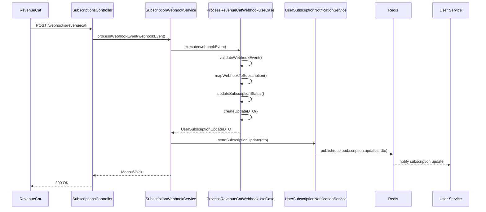

# Refactorización del Servicio de Suscripciones

## 📋 Resumen de Cambios

Se ha refactorizado el sistema de procesamiento de webhooks de RevenueCat para separar las responsabilidades entre el **Subscription Service** y el **User Service**.

## 🏗️ Nueva Arquitectura

### Antes (Acoplado):
```
RevenueCat Webhook → ProcessRevenueCatSubscriptionUseCase → UserRepository → UserEventPublisher
```

### Después (Desacoplado):
```
RevenueCat Webhook → SubscriptionWebhookService → ProcessRevenueCatWebhookUseCase → Redis → User Service
```

## 🔧 Componentes Refactorizados

### 1. **ProcessRevenueCatWebhookUseCase** ✨ (NUEVO)
- **Responsabilidad**: Procesar únicamente el evento de webhook
- **Entrada**: `WebhookEvent`
- **Salida**: `UserSubscriptionUpdateDTO`
- **Funciones**:
  - Validar webhook event
  - Mapear datos de RevenueCat
  - Determinar estado de suscripción
  - Crear DTO para user service

### 2. **UserSubscriptionUpdateDTO** ✨ (NUEVO)
- **Responsabilidad**: DTO para comunicación entre servicios
- **Campos**: Todos los datos de suscripción necesarios
- **Uso**: Transferir información procesada al user service

### 3. **UserSubscriptionNotificationService** ✨ (NUEVO)
- **Responsabilidad**: Comunicación con user service vía Redis
- **Canal**: `user:subscription:updates`
- **Método**: Publish/Subscribe con serialización JSON

### 4. **SubscriptionWebhookService** ✨ (NUEVO)
- **Responsabilidad**: Orquestar el procesamiento completo
- **Flujo**:
  1. Recibe webhook event del controlador
  2. Ejecuta ProcessRevenueCatWebhookUseCase
  3. Envía DTO al user service vía Redis

### 5. **SubscriptionsController** 🔄 (ACTUALIZADO)
- **Cambios**: Ahora usa SubscriptionWebhookService
- **Responsabilidad**: Solo recibir webhooks y delegar

## 🔄 Flujo de Procesamiento



## 🎯 Beneficios de la Refactorización

### ✅ Separación de Responsabilidades
- **Subscription Service**: Solo procesa webhooks de RevenueCat
- **User Service**: Solo actualiza usuarios

### ✅ Desacoplamiento
- No dependencias directas entre servicios
- Comunicación asíncrona vía Redis

### ✅ Escalabilidad
- Cada servicio puede escalar independientemente
- Procesamiento asíncrono de actualizaciones

### ✅ Mantenibilidad
- Código más limpio y enfocado
- Fácil testing de cada componente

### ✅ Resiliencia
- Si user service falla, subscription service sigue funcionando
- Reintentos automáticos en Redis

## 📂 Estructura de Archivos

```
subscriptions_service/
├── controller/
│   └── SubscriptionsController.java (🔄 actualizado)
├── usecases/
│   └── ProcessRevenueCatWebhookUseCase.java (✨ nuevo)
├── services/
│   ├── SubscriptionWebhookService.java (✨ nuevo)
│   └── UserSubscriptionNotificationService.java (✨ nuevo)
├── dto/
│   └── UserSubscriptionUpdateDTO.java (✨ nuevo)
└── DTOs/
    └── WebhookEvent.java (existente)
```

## 🔮 Próximos Pasos

1. **En User Service**: Crear listener de Redis para recibir actualizaciones
2. **Testing**: Crear tests unitarios e integración
3. **Monitoreo**: Agregar métricas y logs
4. **Documentación**: API docs para el nuevo flujo

## 🚀 Resultado

El sistema ahora está completamente desacoplado:
- ✅ Subscription service procesa webhooks independientemente
- ✅ User service actualiza usuarios independientemente  
- ✅ Comunicación asíncrona y resiliente
- ✅ Arquitectura limpia y mantenible
